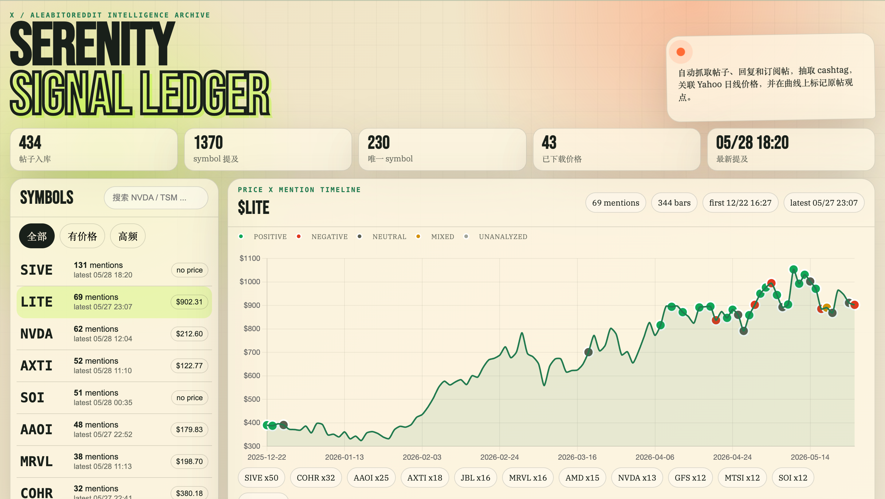

# Serenity Signal Dashboard

This project is a fork of [haskaomni/serenity](https://github.com/haskaomni/serenity) with the following additions:

- **Sentiment analysis** — LLM-based classification (positive / negative / neutral / mixed) for each `$SYMBOL` mention, visualized in the dashboard chart and feed.

The upstream project handles X post ingestion, price downloads, and dashboard visualization. This fork adds `scripts/analyze_sentiment.py` and sentiment-aware UI components.



## Differences From Upstream

This fork adds a sentiment analysis pipeline and dashboard sentiment visualization. If you only need basic X ingestion and price charting, the [original project](https://github.com/haskaomni/serenity) is sufficient.

The upstream hosted version is available at [app.k2ai.dev](https://app.k2ai.dev) (requires [subscription](https://x.com/iamai_omni/creator-subscriptions/subscribe)).

> This project is for research and visualization only. It does not constitute financial advice.

## Quick Start

```bash
python3 -m venv .venv
.venv/bin/python -m pip install -r requirements.txt

.venv/bin/python scripts/ingest.py all --max-pages 10 --days 500 --min-mentions 3
.venv/bin/python scripts/server.py --port 8787
```

Requires Python 3.10+. Open `http://127.0.0.1:8787`.

## Copying X Curl Requests From Chrome

`scripts/ingest.py fetch-x` reads browser-copied curl commands from `x_curl/`. These files must be refreshed on first setup and whenever the X session expires.

1. Log in to X with Chrome and open `https://x.com/aleabitoreddit`.
2. Open DevTools (`F12` or `Cmd/Ctrl + Shift + I`).
3. Navigate to the **Network** panel, filter by `Fetch/XHR`, and optionally search for `UserTweets`.
4. Refresh the page and scroll to trigger timeline loads (posts, replies, premium content).
5. Locate the GraphQL requests listed below. Right-click each and select **Copy** → **Copy as cURL**.
6. Save them with the following filenames:

```text
x_curl/UserTweets.curl
x_curl/UserTweetsAndReplies.curl
x_curl/UserSuperFollowTweets.curl
```

Example (the actual command will be longer and include your session credentials):

```bash
mkdir -p x_curl
cat > x_curl/UserTweets.curl <<'EOF_CURL'
curl 'https://x.com/i/api/graphql/.../UserTweets?variables=...&features=...' \
  -H 'authorization: Bearer ...' \
  -H 'cookie: auth_token=...; ct0=...' \
  -H 'x-csrf-token: ...' \
  -H 'x-twitter-active-user: yes'
EOF_CURL
```

> **Warning:** `x_curl/*.curl` contains session cookies and tokens. These files are ignored by `.gitignore` — do not commit or share them.

## Data Files

| File | Description |
|---|---|
| `data/serenity.sqlite` | SQLite database |
| `data/raw/*.json` | Raw X API responses |
| `dashboard/index.html` | Dashboard page |
| `dashboard/styles.css` | Dashboard styles |
| `dashboard/app.js` | Dashboard client logic |

## Common Commands

```bash
.venv/bin/python scripts/ingest.py fetch-x --max-pages 20
.venv/bin/python scripts/ingest.py prices --days 700 --min-mentions 2
.venv/bin/python scripts/ingest.py stats
.venv/bin/python scripts/ingest.py diagnostics --min-mentions 2
```

## Sentiment Analysis (Optional)

```bash
cp .env.example .env   # Set OPENAI_API_KEY; also set OPENAI_BASE_URL for DeepSeek or other gateways
.venv/bin/python scripts/analyze_sentiment.py direct --limit 20        # Few mentions, direct mode
.venv/bin/python scripts/analyze_sentiment.py batch-create --limit 1000 # Bulk backfill via Batch API
.venv/bin/python scripts/analyze_sentiment.py batch-import --batch-results data/openai_batches/results.jsonl
```

Configuration notes:
- Default model is `gpt-5.4-mini`. Override via `OPENAI_SENTIMENT_MODEL` in `.env` or `--model`.
- Use `-f` / `--force` to re-analyze mentions that already have sentiment rows (e.g. after changing models or prompts).
- `batch-create` automatically falls back to direct mode when the Batch API is unavailable (e.g. DeepSeek), writing results to the database immediately — `batch-import` is unnecessary in that case.
- Direct mode sends up to 50 mentions per API call.

Media metadata (image URLs from `pbs.twimg.com`) is stored in the database. Image bytes are not downloaded or mirrored locally.

If X ingestion returns empty or malformed responses, copy fresh curl commands from Chrome and re-run.

---

# Serenity Signal Dashboard (中文)

本项目 Fork 自 [haskaomni/serenity](https://github.com/haskaomni/serenity)，在此之上增加了：

- **情感分析** — 对每条 `$SYMBOL` 提及进行 LLM 情感分类（positive / negative / neutral / mixed），结果展示在 dashboard 图表和 feed 中。

原项目负责 X 帖子抓取、价格下载和 dashboard 可视化。本 Fork 增加了 `scripts/analyze_sentiment.py` 以及情感相关的 UI 组件。


## 与原项目的区别

本 Fork 增加了情感分析管线和 dashboard 情感可视化。如果你只需要基础的 X 抓取和价格图表，使用[原项目](https://github.com/haskaomni/serenity)即可。

原项目托管版可在 [app.k2ai.dev](https://app.k2ai.dev) 访问（需[订阅](https://x.com/iamai_omni/creator-subscriptions/subscribe)）。

> 本项目仅用于研究和可视化，不构成投资建议。

## 快速开始

```bash
python3 -m venv .venv
.venv/bin/python -m pip install -r requirements.txt

.venv/bin/python scripts/ingest.py all --max-pages 10 --days 500 --min-mentions 3
.venv/bin/python scripts/server.py --port 8787
```

需要 Python 3.10+。打开 `http://127.0.0.1:8787`。

## 从 Chrome 复制 X Curl 请求

`scripts/ingest.py fetch-x` 读取 `x_curl/` 目录中从浏览器复制的 curl 命令。首次使用或登录态过期时需重新复制。

1. 用 Chrome 登录 X，打开 `https://x.com/aleabitoreddit`。
2. 打开 DevTools（`F12` 或 `Cmd/Ctrl + Shift + I`）。
3. 进入 **Network** 面板，筛选 `Fetch/XHR`，可在过滤框搜索 `UserTweets`。
4. 刷新页面并滚动，触发帖子、回复或订阅内容的加载。
5. 找到下方列出的 GraphQL 请求，右键选择 **Copy** → **Copy as cURL**。
6. 按以下文件名分别保存：

```text
x_curl/UserTweets.curl
x_curl/UserTweetsAndReplies.curl
x_curl/UserSuperFollowTweets.curl
```

示例（实际命令更长，包含你的登录凭证）：

```bash
mkdir -p x_curl
cat > x_curl/UserTweets.curl <<'EOF_CURL'
curl 'https://x.com/i/api/graphql/.../UserTweets?variables=...&features=...' \
  -H 'authorization: Bearer ...' \
  -H 'cookie: auth_token=...; ct0=...' \
  -H 'x-csrf-token: ...' \
  -H 'x-twitter-active-user: yes'
EOF_CURL
```

> **注意：** `x_curl/*.curl` 包含登录 cookie/token，已被 `.gitignore` 忽略，不要提交或分享这些文件。

## 数据文件

| 文件 | 说明 |
|---|---|
| `data/serenity.sqlite` | SQLite 数据库 |
| `data/raw/*.json` | X API 原始响应 |
| `dashboard/index.html` | Dashboard 页面 |
| `dashboard/styles.css` | Dashboard 样式 |
| `dashboard/app.js` | Dashboard 客户端逻辑 |

## 常用命令

```bash
.venv/bin/python scripts/ingest.py fetch-x --max-pages 20
.venv/bin/python scripts/ingest.py prices --days 700 --min-mentions 2
.venv/bin/python scripts/ingest.py stats
.venv/bin/python scripts/ingest.py diagnostics --min-mentions 2
```

## 情感分析（可选）

```bash
cp .env.example .env   # 填写 OPENAI_API_KEY；DeepSeek 等兼容网关需设 OPENAI_BASE_URL
.venv/bin/python scripts/analyze_sentiment.py direct --limit 20        # 少量提及，直接模式
.venv/bin/python scripts/analyze_sentiment.py batch-create --limit 1000 # 大量回填，Batch API
.venv/bin/python scripts/analyze_sentiment.py batch-import --batch-results data/openai_batches/results.jsonl
```

配置说明：
- 默认模型为 `gpt-5.4-mini`，通过 `.env` 的 `OPENAI_SENTIMENT_MODEL` 或 `--model` 覆盖。
- `-f` / `--force` 用于重新分析已有情感的提及（如更换模型或调整 prompt 后）。
- `batch-create` 在 Batch API 不可用时自动回退到 direct 模式并直接写入数据库，此时无需执行 `batch-import`。
- direct 模式每批最多发送 50 条提及。

媒体元数据（来自 `pbs.twimg.com` 的图片 URL）存储在数据库中，不下载或镜像图片字节。

如果 X 抓取返回空或格式异常，从 Chrome 重新复制 curl 命令后再运行即可。
